# NERStreamlitApp
 This ReadMe will provide an overview of my custom Named Entity Recognition (NER) application using Python, spaCy, and Streamlit.

 ## 🔗 Click here to access my NER Streamlit App Code
- [Welcome Page Code](https://github.com/cath2705/Paris-Python-Portfolio/blob/main/NERStreamlitApp/Welcome.py)
- [Basic NER Page Code](https://github.com/cath2705/Paris-Python-Portfolio/blob/main/NERStreamlitApp/pages/1_Basic_NER.py)
- [How it Works Page Code](https://github.com/cath2705/Paris-Python-Portfolio/blob/main/NERStreamlitApp/pages/2_How_NER_Works.py)
- [Custom NER Code](https://github.com/cath2705/Paris-Python-Portfolio/blob/main/NERStreamlitApp/pages/4_Custom_NER_Explorer.py)

## 🔗 [Click here to access the NER App!](https://paris-ner.streamlit.app/)

### Custom NER APP
<code>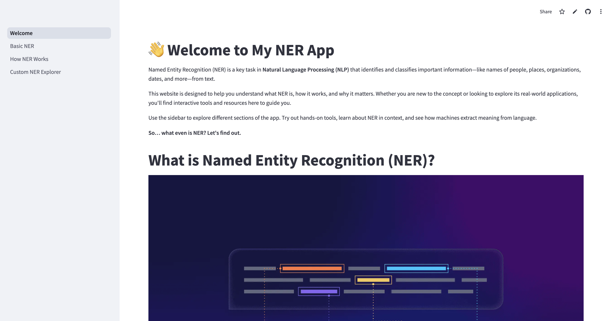</code>

### 📌 Project Overview
This Streamlit web application is a fully interactive, educational platform designed to help users understand and engage with Named Entity Recognition (NER), a core task in Natural Language Processing (NLP). The app introduces the concept of NER, explains how it works, walks users through the steps machines take to identify entities in text, and even allows users to explore NER hands-on using a custom-built entity recognition tool powered by spaCy.

Educational Design Philosophy: This app is built with approachability and interactivity in mind so that non-technical users can still follow explanations and build intuition with examples, visuals, and play. 
_________________________________________________________________________________________________________________________________________________________________________________
## Goals: 
The app is designed to meet the following educational and functional goals:

1. Demystify Named Entity Recognition for beginners through accessible explanations.
2. Illustrate how NER works step-by-step from tokenization to classification.
3. Provide interactive NER experiences, where users can input and analyze text.
4. Allow for custom rule-based entity matching using spaCy's EntityRuler.
5. Encourage exploration and critical thinking with embedded quiz questions, animations, and visual storytelling.
_________________________________________________________________________________________________________________________________________________________________________________

## Overview of the App's Layout 
The app is composed of 4 pages that each serve a different informational purpose. 
Here is an overview of the website structure:
<code>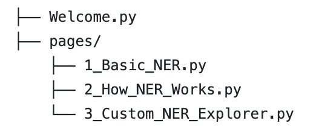</code> 

Here is a description of what each page does: 

1. "Welcome" Page:
- Introduces the concept of NER in simple language.
- Displays images and examples (e.g., Barack Obama being tagged as a PERSON).
- Uses Streamlit Expander widgets to deliver optional deeper learning moments.

2. "Basic NER" Page:
- Loads a base spaCy model (en_core_web_sm).
- Allows user to: Upload a .txt file or input custom text
- Text is analyzed using pre-defined rule patterns
- Uses a custom-built highlight_entities function for colorful entity tagging.
- Prompts users to reflect on what the model got right/wrong (including with ambiguity).
- Features Lottie animations to maintain engagement.

3. "How Ner Works" Page:
- Includes an interactive quiz to let users guess what constitutes a named entity.
- Describes the NER pipeline in five intuitive steps: Tokenization, Entity Identification, Entity Classification, Contextual Analysis, Post-Processing
- Embeds real-world illustrations and text to demonstrate complex topics.
- Discusses ambiguity and context dependency, showcasing challenges in NLP.
- Uses side-by-side columns to compare interpretations visually

4. "Custom NER Explorer" Page:
- Gives users full control to: Enter custom entity labels (e.g., PRODUCT, BRAND), Enter patterns (e.g., words/phrases to match), Dynamically build and save rules
- spaCy’s EntityRuler integrates the user-defined patterns in real time.
- Text is analyzed with both base model + custom patterns.
- Visual feedback shows where rules are applied.
- Empowers users to simulate how rule-based NLP systems work.
_________________________________________________________________________________________________________________________________________________________________________________

## ⚙️ Key Features
Here is an explanation of some of the main features I used to make my app interactive 

1. Quiz Widget
- The "How NER Works" page includes an interactive quiz created with st.radio() and an if/else statement:
- This lets users test their intuition before diving into how machines process similar patterns.

| <code>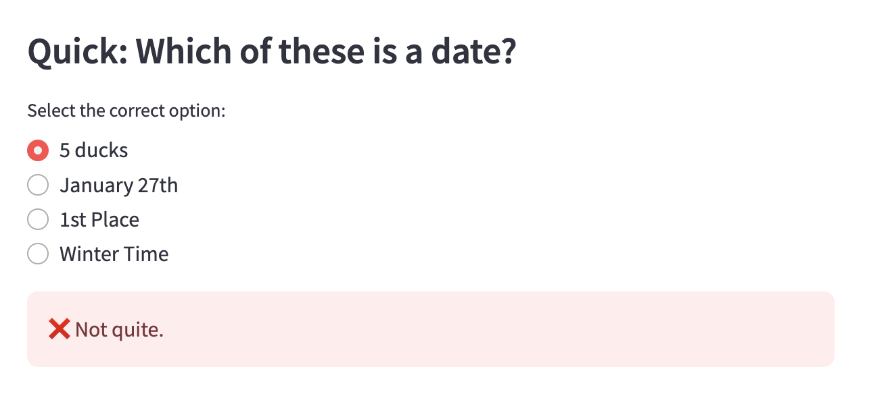</code> | 
|:--:| 
| *What the interactive quiz feature looks like on the streamlit app* |
 

| <code>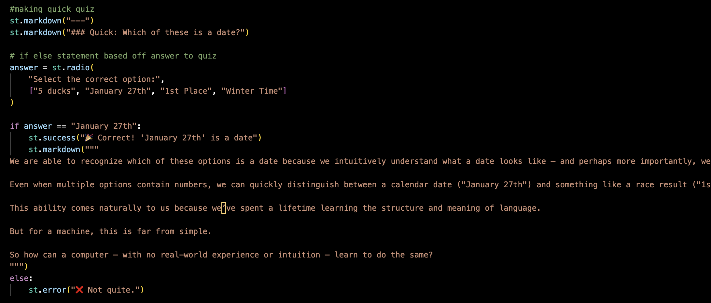</code> | 
|:--:| 
| *Code used to create interactive quiz* |
 

For your reference, here are some sources I used to figure out how to create this  interactive Quiz feature!
- [Interactive Quiz](https://dev.to/blamsa0mine/building-an-interactive-quiz-app-with-streamlit-31l1)

2. Expander Widgets
- Expander widgets are used throughout the app (like on the Welcome and Custom NER pages) to hide large blocks of text until the user is ready. This keeps the interface clean.
- This structure uses Streamlit's context manager (with) to create collapsible content regions.

| <code>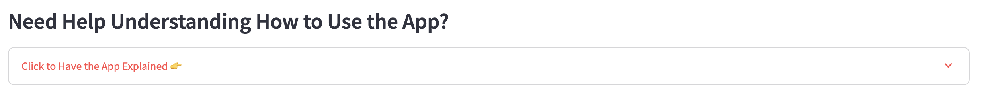</code> | 
|:--:| 
| *What the expander widget feature looks like on the streamlit app* |
 

| <code>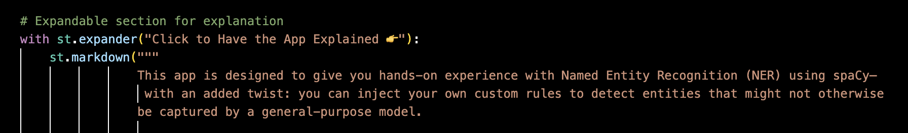</code> | 
|:--:| 
| *Code used to create expander widget* |
 

3. Lottie Animations
- Lottie Animations are a way for me to implement fun animations on to my website pages
- Streamlit doesn’t natively support Lottie JSON animations, so I imported the streamlit-lottie package and fetching animation JSON from a public URL using requests.get().

| <code>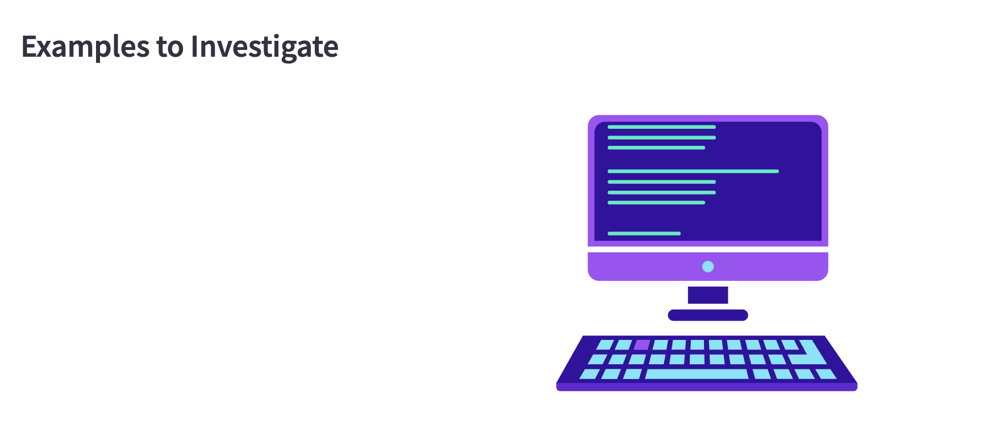</code> | 
|:--:| 
| *What the Lottie Animation feature looks like on the streamlit app* |
 

| <code>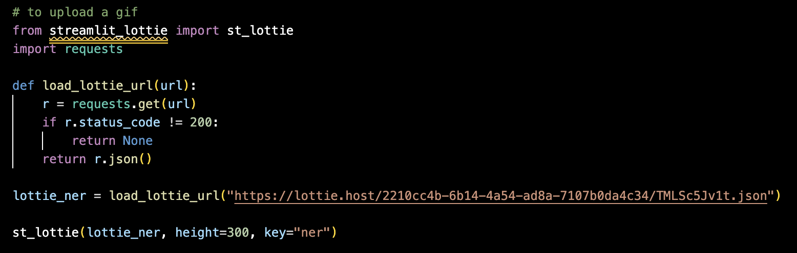</code> | 
|:--:| 
| *Code used to create Lottie Animation* |
 

For your reference, here are some sources I used to figure out how to create this Lottie Animation feature!
- [Lottie Animation](https://www.geeksforgeeks.org/adding-lottie-animation-in-streamlit-webapp/)

4. Custom Entity Rule Builder (Sidebar Form)
- The Custom NER Explorer page uses spaCy’s EntityRuler to let users define custom entity types like "BRAND" or "TECH". 
- Users can add their own custom entity rules (e.g., tagging “Tesla” as a BRAND) directly through a sidebar input form.
- These rules are saved to session state and dynamically used in the entity recognition process.

| <code>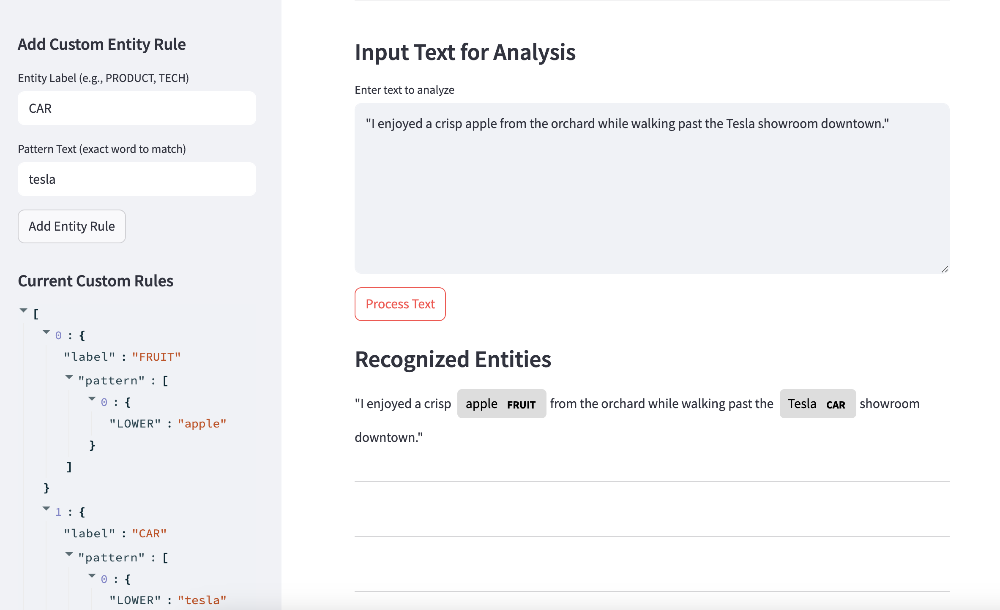</code> | 
|:--:| 
| *What the custom entity rule builder looks like on the streamlit app* |
 

| <code>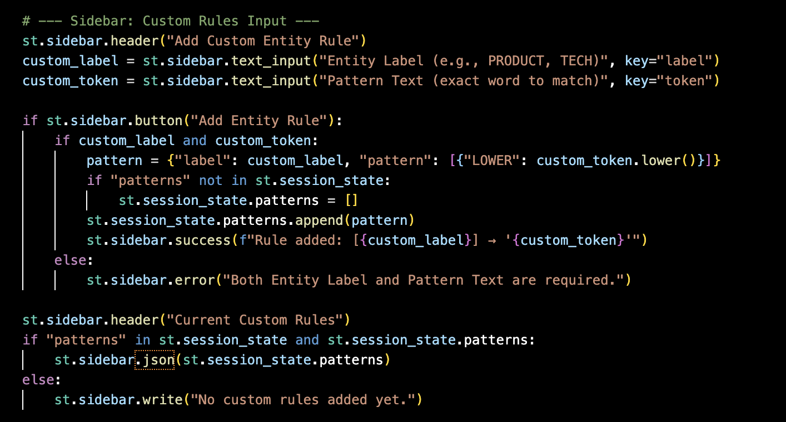</code> | 
|:--:| 
| *Code used to create sidebar custom rule* |
 

5. Live Entity Display with displaCy
- The app uses spaCy’s displacy.render() to visually display named entities in the analyzed text using color-coded highlights.
- This enhances user understanding by showing results in an intuitive, readable format.

| <code>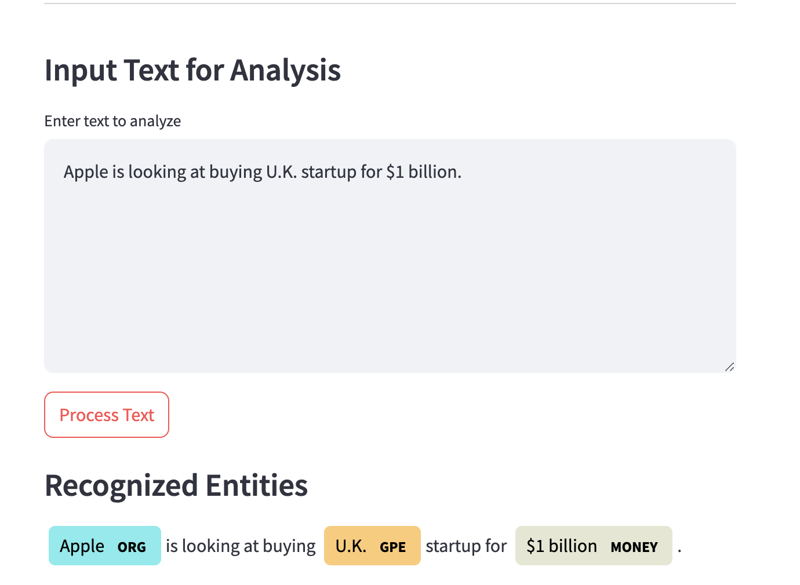</code> | 
|:--:| 
| *What the Live Entity Display feature looks like on the streamlit app* |
 

| <code>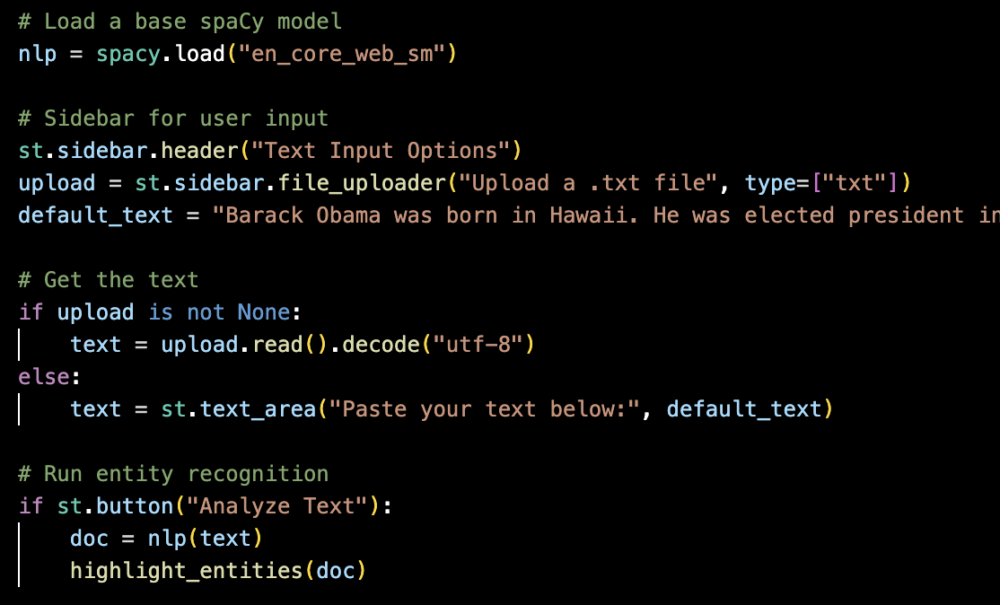</code> | 
|:--:| 
| *Code used to create Live Entity Display* |
 

For your reference, here are some sources I used to figure out how to create Custom Entity Recognition with EntityRuler!
- [EntityRecognizer · spaCy API Documentation](https://spacy.io/api/entityrecognizer)
- [Building a Custom NER Model with spaCy: A Step-by-Step Guide](https://blog.futuresmart.ai/building-a-custom-ner-model-with-spacy-a-step-by-step-guide)
- [Named Entity Recognition (NER) in Python with spaCy](https://www.analyticsvidhya.com/blog/2021/06/nlp-application-named-entity-recognition-ner-in-python-with-spacy/)

_________________________________________________________________________________________________________________________________________________________________________________

 

## 🧰 Skills Demonstrated
This project highlights my ability to:
- 🔧 Build interactive apps with Streamlit
- 🧪 Apply pandas for real-time data filtering and display
- 💻 Write clean, modular Python code
- 🎨 Integrate playful UX features (e.g. success messages, emojis, surprise facts)
-  📊 Bridge data science and interface design for engaging user experiences
 

## 🚀 How to Run This Project
If you'd like to run this Streamlit app yourself,

Clone the repository and then cd NERStreamlitApp

Create a virtual environment and activate it:
- python -m venv ner_env
- source ner_env/bin/activate  # On Windows: ner_env\Scripts\activate

Install dependencies:
- pip install -r requirements.txt

Run the app:
- streamlit run Welcome.py

 

🧑‍💻 Technical Stack
- Language: Python 3.10+
- Framework: Streamlit 1.37.1
- NLP Library: spaCy 3.8.5
- Pretrained Model: en_core_web_sm (v3.8.0)
- streamlit-lottie – for rendering JSON-based Lottie animations
- requests – to fetch external animation files
- Pillow – required by Streamlit to handle image processing
- json – to load and save custom user rules
- os – for file handling and directory management
______________________________________________________________________________________________________________

 

### Enjoy Learning about Named Entity Recognition!
