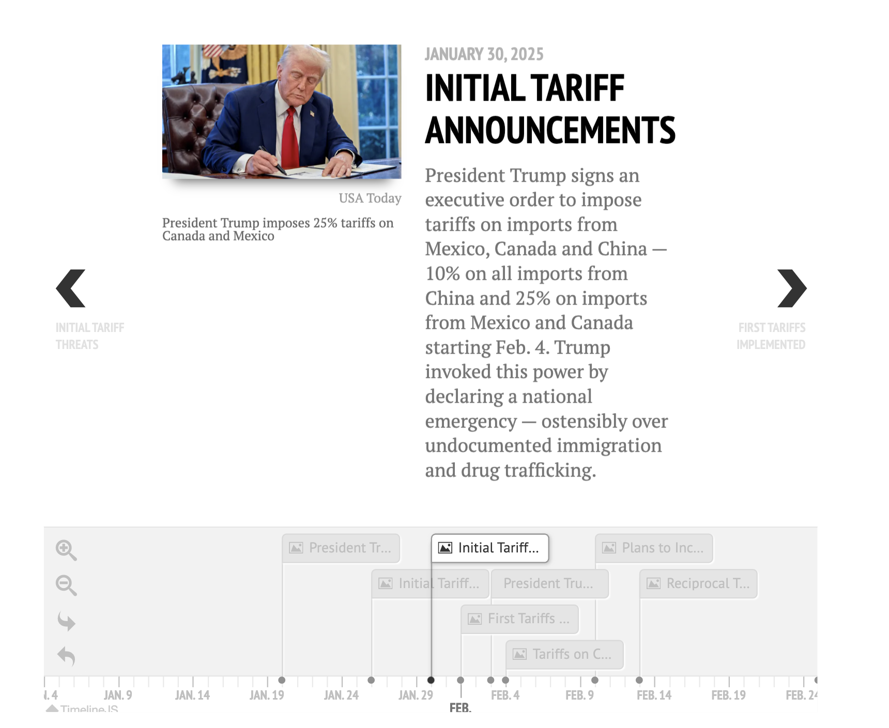
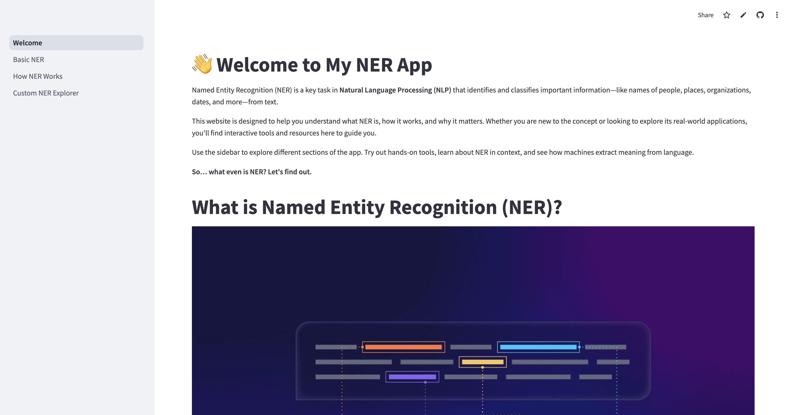
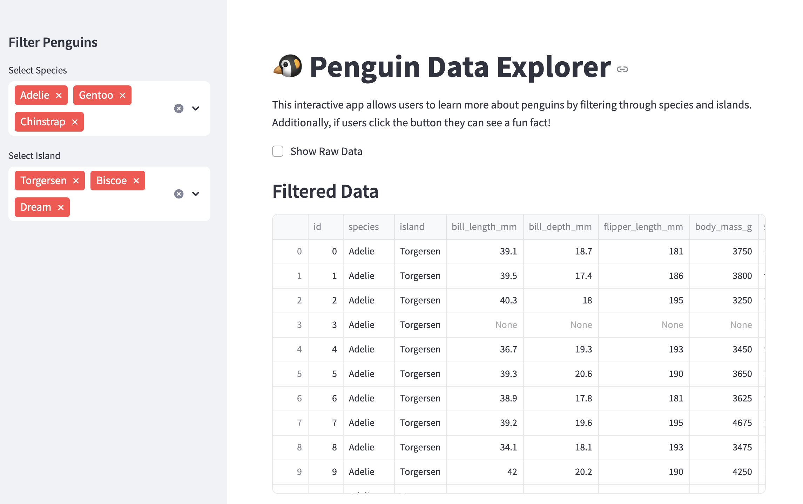

## About my Portfolio
 
This repository serves as a centralized collection of all my projects from Elements of Computing II (Spring 2025). Each project is organized in its own folder for clarity and ease of navigation. My goal is to make my work accessible and well-documented—for both future reference and for others reviewing my portfolio.

Throughout the semester, I made **four major updates** to this GitHub, each tied to a key milestone in the course. In this README, you’ll find a brief **overview of each project, the primary skills** demonstrated, and **direct links** to each folder and its corresponding Streamlit app (when applicable).

As you explore this portfolio, you’ll see a clear progression in both my technical skills and design thinking—from my **early Penguins Data Explorer** to my final, **more complex Trump Tariff Tracker.** Over time, I became increasingly comfortable with:
- UX/UI design in Streamlit
- Interactive data visualizations using Plotly and pandas
- Backend logic to support dynamic filtering, rule-building, and user inputs
- Communicating technical concepts through accessible, educational tools

Each project reflects a step forward in my ability to merge code with **communication, data with design, and functionality with storytelling.**
_______________________________________________________________________________________________________________________________________________
## Projects
## Final Streamlit App: Trump Tariff App
🔗 [View Final Streamlit App Project](https://github.com/cath2705/Paris-Python-Portfolio/tree/main/StreamlitFinal)
🔗 [Click here to access the App!](https://tariff-tracker-catherine.streamlit.app/)

### 📄 Project Description
This project explores the global impact of U.S. tariff policy during the Trump administration through an interactive **Streamlit app** that blends **data visualization,** **historical analysis, and user-driven computation.** Built with **Streamlit, pandas, and Plotly,** the app enables users to navigate a custom-built timeline of key policy events, interact with a choropleth map showing average country-level tariff rates, and use a real-time calculator to assess how tariffs affect consumer prices. The goal is to make complex economic policy more accessible by integrating data science, UX design, and political context into a cohesive and engaging user experience.

<code></code>

### 💼 This project highlights my ability to:
- Build **modular, multi-page Streamlit applications** with clean, well-documented code.
- Integrate **interactive frontend elements** (e.g., st.selectbox, st.number_input, and image embeds) with real-time data processing using pandas.
- Use **Plotly Express** to create hover-enabled, color-scaled choropleth maps that visualize complex policy data by country.
- Implement custom interactive timelines with the **streamlit_timeline** component and **JSON event data.**
- Translate dense political and economic content into engaging, user-friendly tools for exploring historical context and global impact.
- Design with storytelling in mind—combining visualizations, contextual text, and user interactivity to enhance understanding of tariff dynamics.
- Create practical tools (like the tariff calculator) that help users apply abstract policy concepts to real-world financial scenarios.

### Skills: 
Skills: Python, Streamlit, Pandas, Plotly Express, Data Visualization, Interactive Dashboards, JSON, UX/UI Design, Choropleth Maps, Timeline Visualization, User Input Handling

_______________________________________________________________________________________________________________________________________________
## 🔍 Custom Named Entity Recognition (NER) Streamlit App!
🔗 [View NER Streamlit App Project](https://github.com/cath2705/Paris-Python-Portfolio/tree/main/NERStreamlitApp)
🔗 [Click here to access the NER App!](https://paris-ner.streamlit.app/)

### 📄 Project Description
This project focuses on **Named Entity Recognition (NER)** — a foundational **Natural Language Processing (NLP)** task — and presents it through an interactive, educational Streamlit app built from scratch using **spaCy.** The goal of the app is to help users intuitively understand how NER works, experiment with entity recognition on their own text, and even create custom rules for tagging new entity types.

<code></code>

### 💼 This project highlights my ability to:
- Build **multi-page Streamlit applications** with modular, readable code.
- Combine frontend interactivity (st.radio, st.expander, st.columns) with backend **NLP pipelines powered by spaCy**.
- Read in and apply user-defined **JSON patterns** for custom NER tasks.
- Explain complex **NLP workflows** through visuals and storytelling (e.g., how ambiguity and context affect classification).
- Use **web animations (Lottie)** to enhance **UI/UX** in an otherwise technical app.
- Translate technical concepts into interactive learning tools for users without a computer science background.

This app stands out from my other projects by blending creative interface design with real-world NLP functionality, making it a showcase of both my technical fluency and my ability to teach through code.

### Skills: 
Skills: Python, Streamlit, spaCy, Natural Language Processing (NLP), Named Entity Recognition (NER), EntityRuler, JSON, Interactive Dashboards, Data Visualization, UI/UX Design, Custom Rule-Based NLP, Lottie Animations

_______________________________________________________________________________________________________________________________________________
## Tidy Data Project!
🔗 [View the Tidy Data Project](https://github.com/cath2705/Paris-Python-Portfolio/tree/main/TidyDate-Project-main)

### 📄 Project Description
This project is based on Hadley Wickham's "Tidy Data" paper and explores the **principles of organizing datasets** to make analysis easier and more efficient. The project involves:

- Extracting and **cleaning data** from a combined column
- Separating gender and sport from composite strings
- Removing missing or irrelevant data
- Standardizing sport names and fixing formatting inconsistencies
- The result is a clean, well-structured dataset ready for analysis — where each row is an observation, each column is a variable, and each table contains one type of observational unit.

<code></code>

### 💼 This project highlights my ability to:
- Work with real-world messy data
- Apply data wrangling techniques using **Python** and **pandas**
- Follow best practices in **data cleaning and structure**
- It complements my portfolio by demonstrating attention to detail, data intuition, and proficiency in **transforming raw datasets into clean, analyzable formats** — skills essential for data analysis, machine learning, and reporting workflows.

### Skills: 
Skills: Python, Pandas, Data Cleaning, Data Wrangling, Data Preprocessing, Exploratory Data Analysis (EDA), Tidy Data Principles, String Manipulation, Missing Data Handling, Data Normalization, Data Visualization, CSV Parsing, Data Structuring
_______________________________________________________________________________________________________________________________________________

## Basic Penguins Streamlit App!
🔗 [View Basic Penguins Streamlit App](https://github.com/cath2705/Paris-Python-Portfolio/tree/main/basic_streamlit_app)
🔗 [Click here to access the App!](https://paris-python-portfolio-penguins-app.streamlit.app/)

### 📄 Project Description
In this project, I used Streamlit to create an **interactive data exploration** app for the **Palmer Penguins dataset.** This app leverages Streamlit’s **UI components** to allow users to filter, visualize, and analyze penguin data dynamically — right from the browser.

<code></code>

### 💼 This project highlights my ability to:
- Build and **deploy interactive web** apps using Streamlit
- Work with **pandas and data filtering** techniques
- Write clean and modular Python code
- Integrate data science with user-friendly interfaces
- Add playful, engaging features to enhance **UX**

### Skills: 
Skills: Python, Streamlit, Pandas, Data Filtering, Interactive Dashboards, Data Visualization, UI/UX Design, Conditional Rendering, Real-Time Data Updates, Randomization, User Interaction Handling, Exploratory Data Analysis (EDA), Sidebar Widgets, Dataset Exploration

_______________________________________________________________________________________________________________________________________________
