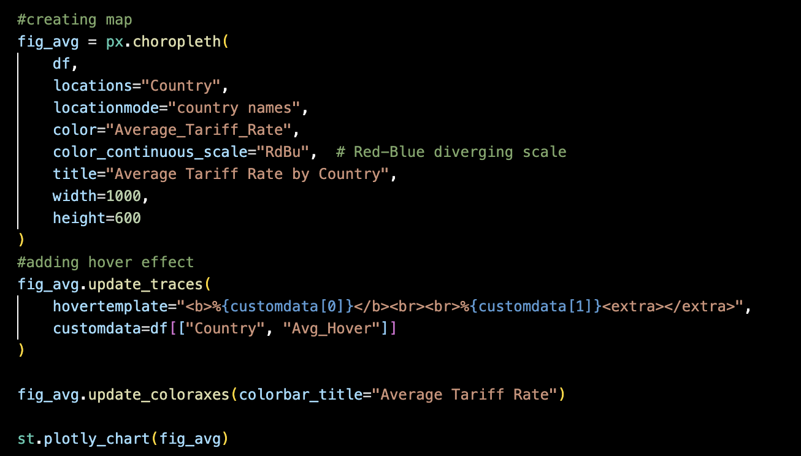

# About my Final Streamlit App!
 This ReadMe will explain my Final Streamlit App, which is an app to explore President Trump's Tariffs

 ## 🔗 [Click here to access my Final Streamlit App Code](https://github.com/cath2705/Paris-Python-Portfolio/blob/main/StreamlitFinal/main.py)
## 🔗 [Click here to access the App!](https://tariff-tracker-catherine.streamlit.app/)

<code></code>

### 📌 Project Overview
Welcome to an interactive web app designed to explore the global impact of U.S. tariffs implemented during the Trump administration. This tool offers multiple interactive features to help users visualize and understand tariff policy in context.

 

Through this app, I demonstrate how to make complex trade policy more accessible by combining data visualization, historical context, and interactive tools. Users can explore U.S. tariff impacts in a hands-on way—understanding not just the what, but also the when, where, and why behind major policy shifts.

## Goals: 
- **Visualize the evolution of U.S. tariff policy** through an interactive, image-rich timeline of major global trade events during the Trump administration.
- **Map the global impact of U.S. tariffs** using an intuitive hover map that shows the average effective tariff rate per country.
- **Clarify the difference between old and new tariff** policies, especially around the April 9th freeze, by enabling users to compare rates over time.
- **Demonstrate real-world effects** with a tariff calculator that shows how price changes for imported goods vary based on country of origin and tariff policy shifts.
- **Promote critical thinking** about trade policy through hands-on interaction, visual storytelling, and historical context—not just raw numbers.

## App Layout
The app is divided into three main pages:
- **Timeline Page**
Explore an interactive timeline featuring key events, complete with images and descriptions, that shaped recent U.S. tariff policy.

 

- **Global Map Page**
View a hover-enabled world map that displays the average effective U.S. tariff rate imposed on each country. This provides a broad, comparative view of tariff intensity across the globe.

 

- **Tariff Calculator Page** 
Enter the base price of an item and instantly calculate its cost after U.S. tariffs, based on the selected country's average tariff rate.

 

## ⚙️ App Features

**"Tariff Timeline" Page:**
- Loads an interactive timeline using the streamlit_timeline component and custom JSON data.
- Displays key global tariff events during Trump’s 2025 administration, including executive orders and international responses.
- Embeds high-quality media (e.g., images from CNN) to contextualize each event.
  
| <code></code> | 
|:--:| 
| *What the interactive timeline feature looks like on the streamlit app* |
 

| <code></code> | 
|:--:| 
| *Code used to create interactive timeline. Note: this is only a snippet of the full code. I had to code in the images, text, and sources for each point on the timeline* |
 

**"Global Map" Page:**
- Loads a CSV dataset of country-level tariff rates and computes an average effective rate.
- Uses Plotly Express to generate an interactive choropleth world map.
- Users can hover over any country to view the exact average tariff rate the U.S. has imposed.
- Applies a red-to-blue diverging color scale to visually communicate tariff intensity.
  
| <code></code> | 
|:--:| 
| *What the hover map feature looks like on the streamlit app. In this image, you can see I am hovering over Chad.* |
 

| <code></code> | 
|:--:| 
| *Code used to create hover map. When executing yourself, make sure to upload a dataset first!* |
 

**"Tariff Calculator" Page:**
- Allows users to select a country and input a product’s base price.
- Uses Streamlit widgets (selectbox and number_input) for dynamic interactivity.
- Automatically calculates product prices under both pre- and post-April 9th tariff rates.

| <code></code> | 
|:--:| 
| *What the Tariff Calculator feature looks like on the streamlit app. In this image, you can see the calculators gave me the new price of a $10 item* |
 

| <code></code> | 
|:--:| 
| *Code used to create Tariff Calculator* |
 

## 🧰 Skills Demonstrated
This project highlights my ability to:

- 🔧Build multi-page interactive apps using Streamlit
- 📊 Visualize data dynamically with Plotly and pandas
- 🧮 Implement real-time calculations with responsive user inputs
- 🎨 Design accessible, engaging interfaces using images, hover maps, and success messages
- 📚 Combine historical context with data science to tell meaningful, policy-driven stories
  
 

## Running This App
If you'd like to run this Streamlit app yourself,
1) clone the repo & then cd Trump-Tariff-Tracker

 

2) Install requirements: 
pip install streamlit pandas plotly streamlit_timeline

 

3) Run the app:
streamlit run main.py

### Enjoy Learning about Tariffs
<code></code>
