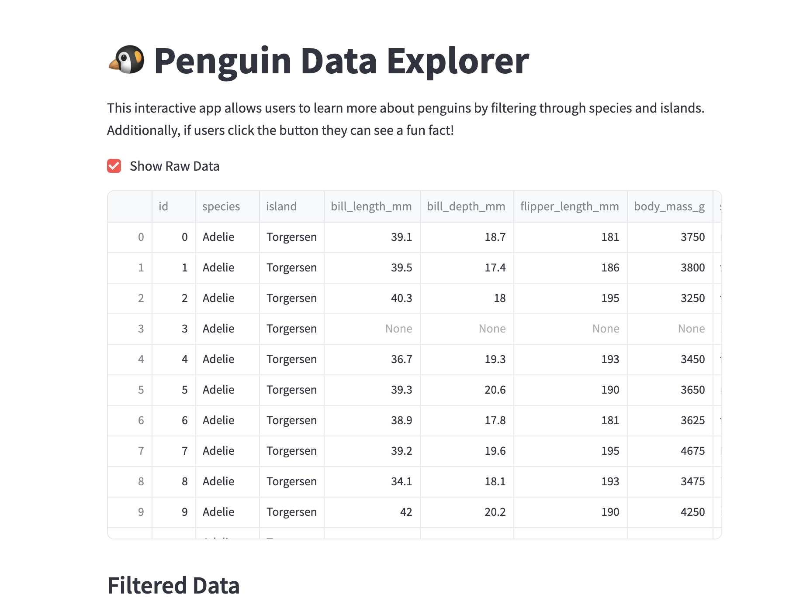

# About my Basic Penguins Streamlit App!
 This ReadMe will explain my Basic Penguins Streamlit App

 ## 🔗 [Click here to access my Basic Penguins Streamlit App Code](https://github.com/cath2705/Paris-Python-Portfolio/blob/main/basic_streamlit_app/main.py)
## 🔗 [Click here to access the App!](https://paris-python-portfolio-penguins-app.streamlit.app/)

<code></code>

### 📌 Project Overview
Welcome to my Basic Penguins Streamlit App — an interactive web tool that explores the Palmer Penguins dataset! This project uses Streamlit to create a browser-based interface where users can explore real-world penguin data by filtering, visualizing, and analyzing attributes like species, island, and physical features.
- Through this app, I demonstrate how to:
- Create dynamic filters for data exploration
- Display filtered tables in real-time
- Include UI elements like buttons, checkboxes, and success messages
- Add playful, engaging features to improve UX

## Goals: 
The goal of this project is to transform a dataset containing information about penguin species, island location, and physical attributes (e.g., flipper length, body mass, sex) into an interactive app that allows users to easily explore correlations between these variables and analyze the data in a fun, engaging way.

## ⚙️ Features
The app starts with a welcoming title and provides an easy-to-use interface with sidebar filters and interactive plots.  
- I used st.sidebar.multiselect() to create multi-selection dropdowns for users to filter data. Specifically users can filter the dataset by species and island. These inputs dynamically update the data shown in the app using:  

| <code></code> | 
|:--:| 
| *Code used to create data-filtering feature* |
 

| <code></code> | 
|:--:| 
| *What the sidebar feature looks like on the streamlit app* |
 

- By using the st.checkbox("Show Raw Data") command, I created a checkbox that users can click to toggle raw data on and off. This allows users of the app to choose whether to view the full DataFrame. 

| <code></code> | 
|:--:| 
| *Code used to create checkbox feature* |

 

| <code></code> | 
|:--:| 
| *What the checkbox feature looks like on the streamlit app* |

 

- I created a fun penguin fact button. When clicked, the app randomly selects and displays a penguin fun fact. To do this i used st.button() to create a button, random.choice(facts) so that the app will select and display a random fact from a predefined list, and st.success() to render the selected fact with a highlighted success message. All this comes toegther so that when users click the fun fact button, users learn random facts, adding a fun touch to the app.

  
| <code></code> | 
|:--:| 
| *What the fun fact feature looks like on the streamlit app* |

 

## Sample Use Case
Let's say you're interested in Adelie penguins located on Torgersen island. Simply check those boxes on the left panel, and the table will instantly update to display only those results. 

| <code></code> | 
|:--:| 
| *What the app looks like before you filter for Adelie penguins located on Torgersen island. In other words, what the app looks like before any filtering* |

 

| <code></code> | 
|:--:| 
| *What the app looks like AFTER you filter for Adelie penguins located on Torgersen island.* |

 

## 🧰 Skills Demonstrated
This project highlights my ability to:
- 🔧 Build interactive apps with Streamlit
- 🧪 Apply pandas for real-time data filtering and display
- 💻 Write clean, modular Python code
- 🎨 Integrate playful UX features (e.g. success messages, emojis, surprise facts)
- 📊 Bridge data science and interface design for engaging user experiences
 

## 🚀 Running This App

If you'd like to run this Streamlit app yourself,
1) clone the repo: 
git clone https://github.com/cath2705/Paris-Python-Portfolio.git 
cd basic_streamlit_app

 

2) Install requirements: 
pip install streamlit pandas 

 

3) Run the app:
streamlit run main.py

### Enjoy Learning about Penguins!
<code></code>
